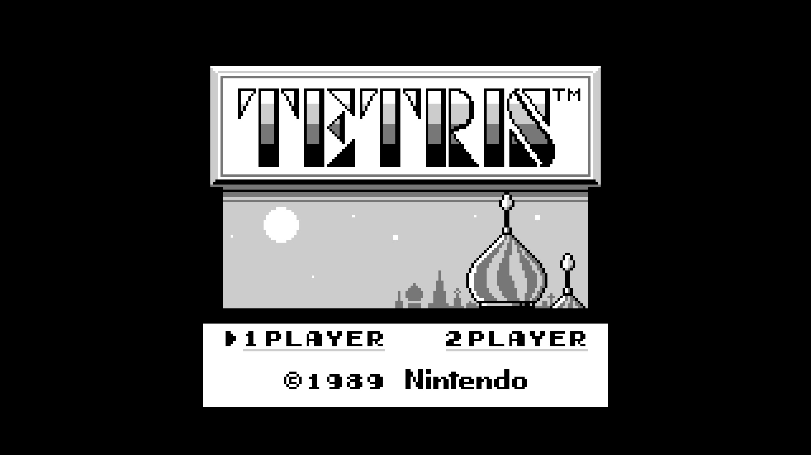

# Nana.cpp (ナナ.cpp)

> “Forgetting about our mistakes and our wounds isn't enough to make them disappear.”
>
> [Nana (manga), by Ai Yazawa](https://en.wikipedia.org/wiki/Nana_(manga))

Nana.cpp (ナナ.cpp) is a [Game Boy](https://en.wikipedia.org/wiki/Game_Boy) emulator for the [Nintendo Switch](https://en.wikipedia.org/wiki/Nintendo_Switch) system. It's a complete rewrite of [Nana (ナナ)](https://github.com/Ruenzuo/nana) because of some limitations of the Golang toolchain and runtime in Horizon/aarch64. Because of this, it shares all bugs and missing features of her big sister.



### Dependencies

Nana.cpp uses [devkitA64](https://github.com/devkitPro) and [libnx](https://github.com/switchbrew/libnx). See the [Setting up Development Environment](https://switchbrew.org/wiki/Setting_up_Development_Environment) from the SwitchBrew wiki.

### Compiling

```
$ make -f aarch64.mk
```

### Usage

Nana.cpp currently uses romfs. Place the ROMs you want to use in `romfs/roms` and edit [`main.cpp`](https://github.com/Ruenzuo/nana.cpp/blob/master/src/main.cpp#L32) to load the right file. Until this is addressed, I can't distribute precompiled binaries for obvious reasons. 
